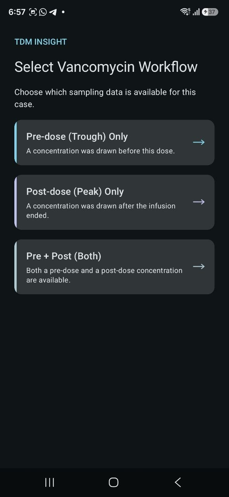
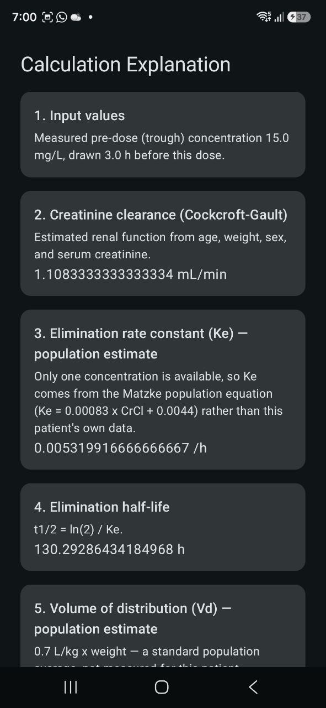
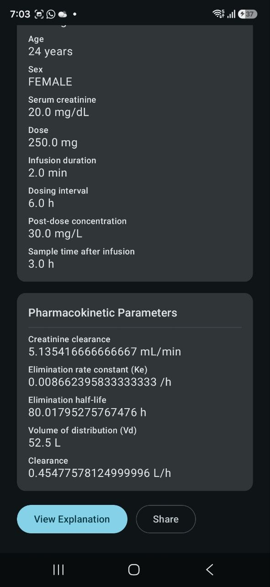
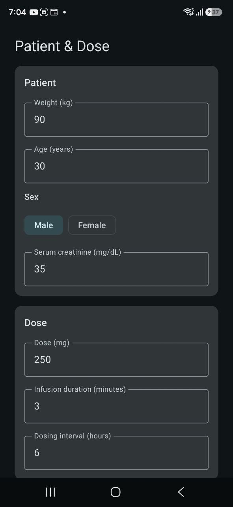

# TDM Insight

Native Android Therapeutic Drug Monitoring (TDM) Calculator — Vancomycin
Pre, Post, and Pre + Post workflows.

> Status: all mandatory workflows (Phases 0–5 of
> `docs/Implementation_Roadmap.md`) are implemented — dynamic input
> forms, validation, the Vancomycin calculation engine, and the
> results/explanation UI. The calculation engine's formulas are drawn
> from the named authoritative sources in the case study (PhIS TDM
> Calculator Manual, myTDM Calculator) and the standard, peer-reviewed
> pharmacokinetics literature they're built on — see
> `docs/Calculation_Method_Proposal.md` for the full derivation and
> citations. Optional enhancements (Phase 6) and final submission
> packaging (Phase 7 — this README, the AI Usage Log, screenshots, and
> the release APK) are in progress.

## Course Information

- **Course code:** CDE2313 — Mobile Application Development
- **Programme:** Bachelor in Data Science
- **Institution:** Albukhary International University
- **Assessment:** Group Project (Assessment 2)

## Group Members

| Student Name | Student ID |
|---|---|
| Abdulaziz Taju Mohammedyasin | AIU24102453 |
| Amir Wuhab Nurhussen | AIU24102454 |
| Bonson Adem Alo | AIU24102383 |

## Case Study

**Problem overview:** Vancomycin dosing needs to be adjusted per patient
using Therapeutic Drug Monitoring (TDM) — measured blood concentrations
are used to work out patient-specific pharmacokinetic parameters (e.g.
elimination rate, half-life, volume of distribution, clearance) so that
future dosing can be reasoned about safely. Manually walking through
this calculation is repetitive and error-prone, and the process differs
depending on which concentration samples are available: only a
pre-dose (trough) sample, only a post-dose (peak) sample, or both. See
`docs/Case_Study_Analysis.md` for the full breakdown of mandatory and
optional requirements.

**Summary of implemented solution:** TDM Insight is a native Android
app that walks a user through all three Vancomycin TDM workflows —
**Pre**, **Post**, and **Pre + Post** — with a dynamic input form that
only shows the fields each workflow actually needs, thorough input and
cross-field validation (including protection against division-by-zero
and invalid-logarithm cases), a calculation engine kept structurally
separate from the UI, and a Results screen that shows every input value
and intermediate pharmacokinetic parameter — not just a final number —
alongside a step-by-step Explanation screen. A calculated result can
also be shared/exported as a plain-text summary. The app is an academic
prototype: it is not a clinically validated prescribing, diagnostic, or
treatment-decision system (see `docs/Calculation_Method_Proposal.md`
for the calculation methodology and its sources).

## Key Implemented Features

- **Workflow selection** — choose Vancomycin Pre, Post, or Pre + Post;
  the choice drives every screen that follows.
- **Dynamic patient/dose input form** — only the fields relevant to the
  selected workflow are shown, never a static superset.
- **Input validation** — required fields, numeric/unit checks, range
  checks, and cross-field/timing checks (e.g. a pre-dose sample can't
  be older than one full dosing interval), with error messages phrased
  for a general user rather than a raw exception.
- **Calculation engine, separated from the UI** — patient/dose/sample
  data flows through validation into a dedicated engine
  (`domain/calculation/TdmCalculationEngine.kt`), which guards against
  division-by-zero and invalid-logarithm inputs (e.g. a non-increasing
  Pre+Post concentration pair) and returns a typed success/failure
  result rather than crashing.
- **Results screen** — shows the input values used and every
  intermediate pharmacokinetic parameter (creatinine clearance,
  elimination rate constant, half-life, volume of distribution,
  clearance), not just a final number.
- **Explanation screen** — a step-by-step walkthrough of how the result
  was reached (Input Values → Intermediate Values → Pharmacokinetic
  Parameters → Final Result), naming which method was used (a
  population estimate for single-sample workflows, or a
  patient-specific two-point calculation for Pre + Post).
- **Export/share a result** — a calculated result (including the
  academic-prototype disclaimer) can be shared as plain text via
  Android's share sheet.
- **Automated tests** — JUnit unit tests for validation and the result
  formatter, and Compose UI tests covering dynamic form behaviour, the
  results/explanation screens, and full end-to-end workflow runs
  (`app/src/test`, `app/src/androidTest`).

## Technology Stack & Application Architecture

- Platform: Native Android
- Language: Kotlin
- UI: Jetpack Compose, Material 3
- IDE: Android Studio

The app follows a one-directional layering, kept deliberately simple
for a project this size (no ViewModel/Room where a smaller state holder
or plain function already does the job):

```
UI (Compose screens)
  ↓
Input State (PatientFormState, etc.)
  ↓
Validation (domain/validation)
  ↓
TDM Calculation Engine (domain/calculation)
  ↓
Result Model (domain/model — TdmResult, PharmacokineticParameters)
  ↓
Results / Explanation UI (ui/results)
```

Calculation and validation logic lives in plain Kotlin classes under
`domain/`, with no dependency on Compose or Android UI APIs, so it can
be unit tested directly and stays reusable if the UI layer changes.

## Installation Guide

1. Install [Android Studio](https://developer.android.com/studio)
   (current stable channel) with an Android SDK covering API level 35
   (minSdk/targetSdk) and 37 (compileSdk).
2. Clone this repository and open it in Android Studio — it will
   prompt to sync Gradle automatically.
3. Run the app on an emulator or a connected device (API 35+) via the
   Run button, or see *How to Build* below for the command line.

## How to Build the Project

From the repository root:

```bash
./gradlew assembleDebug      # debug build
./gradlew test               # JVM unit tests (app/src/test)
./gradlew connectedAndroidTest   # instrumented UI tests, needs a device/emulator
```

## APK Download

[`apk/app-release.apk`](apk/app-release.apk) — a release-variant build,
currently signed with the standard Android **debug** key (not a
production release key) purely for installability on a test device;
replace with a proper release keystore if this project ever needs a
production-grade signature.

## Screenshots

| Workflow selection | Patient & dose form |
|---|---|
|  |  |

| Results | Explanation |
|---|---|
|  |  |

More captures, covering all three workflows and validation error states, are in
[`screenshots/`](screenshots/).

## GitHub Repository Structure

```
Tdm-calculator/
│
├── README.md
├── LICENCE
├── .gitignore
├── CLAUDE.md
│
├── app/                     # Android Studio Project
├── gradle/                  # Gradle configuration
│
├── screenshots/             # Screenshots for the mobile app
│
├── docs/                    # Related documentation
│   ├── Case_Study_Analysis.md
│   ├── Implementation_Roadmap.md
│   ├── assessment/           # Official assessment requirement PDFs
│   ├── wireframe/
│   └── diagrams/
│
├── apk/                     # Release-ready APK file
│   └── app-release.apk
│
├── ai/                      # Concise AI usage declaration
│   └── AI_Usage_Log.pdf
│
└── assets/                  # Supporting resources
```

## Acknowledgements

- Case study and assessment prepared by Ts Mohd Zulkifli Mohd Zaki,
  Albukhary International University.
- Reference tools consulted for domain understanding: myTDM Calculator,
  Malaysian Pharmacy Information System (PhIS) TDM Calculator
  documentation.

## References

Sources consulted for the calculation engine's formulas — see
`docs/Calculation_Method_Proposal.md` for the full derivation of what
each was used for.

- Pharmacy Information System (PhIS). (n.d.). *TDM calculator manual*
  (13th ed.) [PDF]. Ministry of Health Malaysia.
  https://phisportal.moh.gov.my/sites/default/files/phis_attachments_39556/PB_U.%20MANUAL_TDM%20CALCULATOR-13th%20E.pdf
- myTDM Calculator. (n.d.). https://www.mytdmcalculator.com/
- Cockcroft, D. W., & Gault, M. H. (1976). Prediction of creatinine
  clearance from serum creatinine. *Nephron, 16*(1), 31–41.
  https://doi.org/10.1159/000180580
- Matzke, G. R., McGory, R. W., Halstenson, C. E., & Keane, W. E.
  (1984). Pharmacokinetics of vancomycin in patients with various
  degrees of renal function. *Antimicrobial Agents and Chemotherapy,
  25*(4), 433–437.
- Sawchuk, R. J., & Zaske, D. E. (1976). Pharmacokinetics of dosing
  regimens which utilize multiple intravenous infusions: Gentamicin in
  burn patients. *Journal of Pharmacokinetics and Biopharmaceutics,
  4*(2), 183–195.
